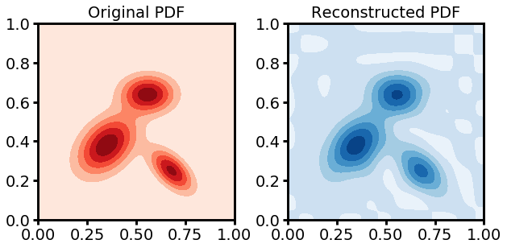
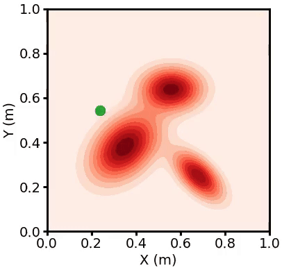
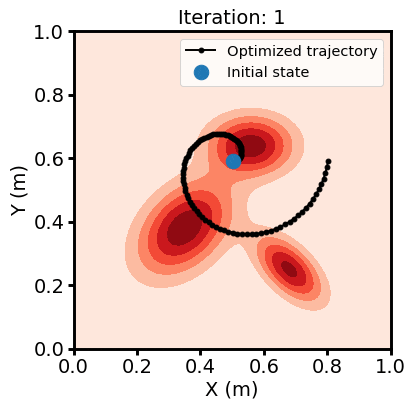
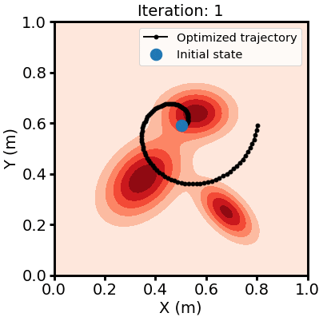

# ergodic-control-sandbox
Sandbox code for "Tutorial on Ergodic Control @ ICRA 2024"

## Table of contents

| *Tutorial* | *Code* | 
| :---: | :---: |
| **Introduction to Ergodic Metric** <br>  | [[Jupyter Notebook]](notebooks/ergodic_metric.ipynb) <br> [[Google Colab]](https://colab.research.google.com/github/MurpheyLab/ergodic-control-sandbox/blob/main/notebooks/ergodic_metric.ipynb) | 
| **Closed-Form Ergodic Control** <br>  | [[Jupyter Notebook]](notebooks/smc_ergodic_control.ipynb) <br> [[Google Colab]](https://colab.research.google.com/github/MurpheyLab/ergodic-control-sandbox/blob/main/notebooks/smc_ergodic_control.ipynb) | 
| **Trajectory Optimization for Ergodic Control** <br>  | [[Jupyter Notebook]](notebooks/ilqr_ergodic_control.ipynb) <br> [[Google Colab]](https://colab.research.google.com/github/MurpheyLab/ergodic-control-sandbox/blob/main/notebooks/ilqr_ergodic_control.ipynb) |
| **Ergodic Control with Kernel Functions** <br>  | [[Jupyter Notebook]](notebooks/kernel_ergodic_control.ipynb) <br> [[Google Colab]](https://colab.research.google.com/github/MurpheyLab/ergodic-control-sandbox/blob/main/notebooks/kernel_ergodic_control.ipynb) |
| **Ergodic Metric for Point Cloud Registration** <br>  | [[GitHub Repo]](https://github.com/MurpheyLab/FLS) |  


## Copyright and License

The implementations contained herein are copyright (C) 2024 - 2025 by Muchen Sun, and are distributed under the terms of the GNU General Public License (GPL) version 3 (or later). Please see the LICENSE for more information.

If you use the sandbox in your research, please cite this repository. You can see the citation information at the right side panel under "About". The BibTeX file is attached below:
```
@software{Sun_Sandbox_code_for_2024,
author = {["Sun", "Murphey"], Muchen, Todd},
license = {GPL-3.0},
month = jul,
title = {{Sandbox code for "Tutorial on Ergodic Control @ ICRA 2024"}},
url = {https://github.com/MurpheyLab/ergodic-control-sandbox},
version = {0.0.1},
year = {2024}
}
```

Contact: muchen@u.northwestern.edu

Lab Info: Prof. Todd D. Murphey, [Interactive & Emergent Autonomy Lab](https://murpheylab.github.io/) / [Center for Robotics and Biosystems](https://robotics.northwestern.edu/) / Northwestern University
